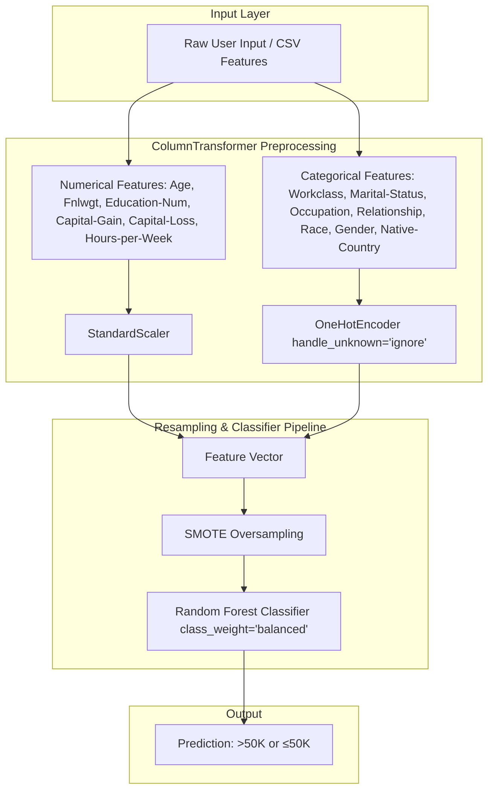

# 💼 Employee Salary Prediction (ESP)

> **Predicting Employee Income Classes (`>50K` vs `≤50K`) Using Imbalanced Machine Learning Pipelines & Streamlit**

[](https://www.python.org/)
[](https://scikit-learn.org/)
[](https://streamlit.io/)
[](https://imbalanced-learn.org/)
[](LICENSE)

---

## 📌 Overview

The **Employee Salary Prediction (ESP)** system is an end-to-end machine learning application that predicts whether an individual earns more than **$50,000/year** (`>50K`) or **$50,000 or less** (`≤50K`) based on their demographic background, education, and employment characteristics.

Trained on the **Adult Census Income Dataset**, the project addresses real-world machine learning challenges including **severe class imbalance**, mixed feature types (numerical and high-cardinality categorical), and deployment via an interactive **Streamlit** web application.

---

## 🚀 Key Features

* **Complete EDA & Preprocessing**: Cleaned raw census records, handled missing values, standardized numeric columns, and one-hot encoded categorical variables.
* **Class Imbalance Handling**: Applied **SMOTE (Synthetic Minority Over-sampling Technique)** to balance the minority `>50K` class against the majority `≤50K` class.
* **Multi-Model Benchmarking**: Evaluated multiple classifiers including:
  * **Random Forest Classifier** (`class_weight='balanced'`)
  * **Gradient Boosting Classifier**
  * **K-Nearest Neighbors (KNN)**
* **End-to-End Pipeline Architecture**: Encapsulates data preprocessing (`StandardScaler` + `OneHotEncoder`), SMOTE resampling, and model inference into a single serialized `imblearn.pipeline.Pipeline`.
* **Interactive Streamlit Web App (`app.py`)**: User-friendly GUI allowing users to adjust sliders and select demographic attributes to get real-time salary predictions.

---

## 🏗️ Architecture & Pipeline Flow



---

## 📊 Dataset Features

The model is trained on the Adult Census Income dataset (`adult 3.csv`) containing 14 predictive features:

| Feature Name | Type | Description / Sample Values |
|---|---|---|
| `age` | Numeric | Age of the individual ($17\text{--}90$) |
| `workclass` | Categorical | Employment sector (`Private`, `Self-emp-inc`, `Federal-gov`, etc.) |
| `fnlwgt` | Numeric | Census final weight (demographic weighting factor) |
| `education-num` | Numeric | Completed years of education ($1\text{--}16$) |
| `marital-status` | Categorical | Marital status (`Married-civ-spouse`, `Divorced`, `Never-married`, etc.) |
| `occupation` | Categorical | Job category (`Exec-managerial`, `Prof-specialty`, `Tech-support`, etc.) |
| `relationship` | Categorical | Family relationship (`Husband`, `Wife`, `Own-child`, `Unmarried`, etc.) |
| `race` | Categorical | Racial background (`White`, `Black`, `Asian-Pac-Islander`, etc.) |
| `gender` | Categorical | Biological sex (`Male`, `Female`) |
| `capital-gain` | Numeric | Capital gains reported in US Dollars ($0\text{--}99,999$) |
| `capital-loss` | Numeric | Capital losses reported in US Dollars ($0\text{--}4,356$) |
| `hours-per-week` | Numeric | Typical working hours per week ($1\text{--}99$) |
| `native-country` | Categorical | Country of origin (`United-States`, `India`, `Mexico`, etc.) |
| **`income`** | **Target** | **Salary Class: `>50K` or `≤50K`** |

---

## 📂 Project Structure

```bash
ESP/
├── adult 3.csv                               # Census Income dataset
├── app.py                                    # Streamlit web application
├── best_model_v2.pkl                         # Serialized imblearn pipeline (Model + Preprocessor)
├── employee_salary_prediction_(new).ipynb   # Jupyter training notebook (EDA, training, evaluation)
├── label_encoders.pkl                        # Pre-fitted label encoders
├── requirements.txt                          # Python dependencies
└── README.md                                 # Project documentation
```

---

## ⚙️ Installation & Setup

### 1. Clone or Open the Repository
```bash
cd d:\Projects\ESP
```

### 2. Create and Activate Virtual Environment
```bash
# Windows
python -m venv venv
venv\Scripts\activate

# Linux / macOS
python3 -m venv venv
source venv/bin/activate
```

### 3. Install Dependencies
```bash
pip install -r requirements.txt
```

*(Ensure `scikit-learn`, `imbalanced-learn`, `streamlit`, `pandas`, and `joblib` are installed).*

### 4. Run the Streamlit Application
```bash
streamlit run app.py
```

The web application will open in your default browser at:
```text
http://localhost:8501
```

---

## 🌐 Deployment Guide

### Deploying on Streamlit Community Cloud (Free)
1. Push this project repository to **GitHub**.
   > **Note on Model Size**: If your `best_model_v2.pkl` exceeds GitHub's 100 MB upload limit, either track it with **Git LFS** or compress it using `joblib.dump(model, "best_model_v2.pkl", compress=3)`.
2. Go to [share.streamlit.io](https://share.streamlit.io/) and log in with GitHub.
3. Select your repository, branch (`main`), and main file (`app.py`).
4. Click **Deploy!** Your app will be live with a public URL.

### Deploying on Hugging Face Spaces (Free CPU 16 GB RAM)
1. Create a new Space on [Hugging Face Spaces](https://huggingface.co/spaces) with **Streamlit** SDK.
2. Clone the space repository and copy `app.py`, `best_model_v2.pkl`, and `requirements.txt`.
3. Commit and push. Hugging Face natively supports large model files with built-in Git LFS.

---

## 📈 Model Performance & Evaluation

* **Selected Model**: Tuned `RandomForestClassifier` with balanced class weights.
* **Resampling**: `SMOTE` oversampling on the minority class during cross-validation.
* **Evaluation Metrics**:
  * **Precision & Recall**: Evaluated using `classification_report` to ensure high recall for high-earning individuals (`>50K`).
  * **Accuracy**: High test-set accuracy balanced across both positive and negative wage classes.

---

## 👨‍💻 Author & License

* **Author**: Sai Chaitanya
* **License**: This project is open-source and available under the [MIT License](LICENSE).
